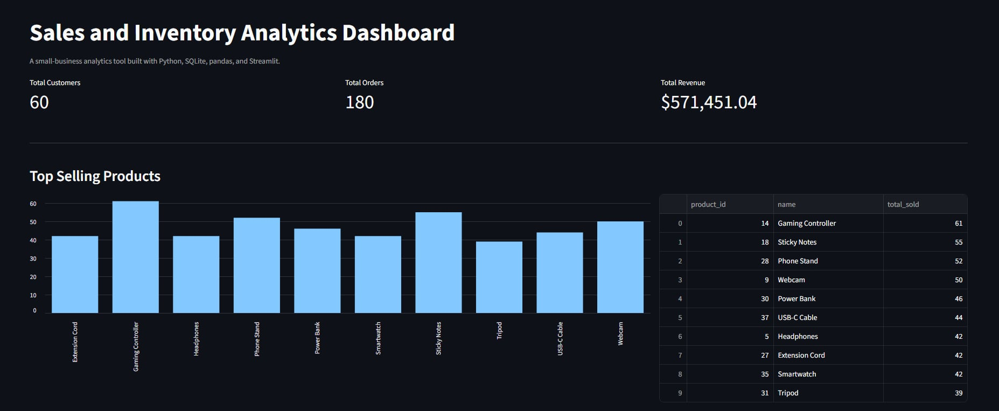
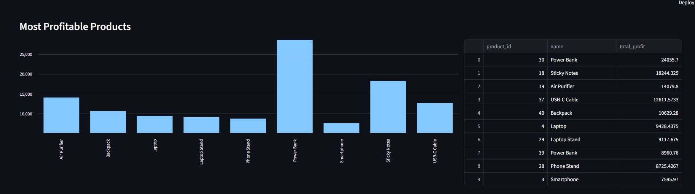
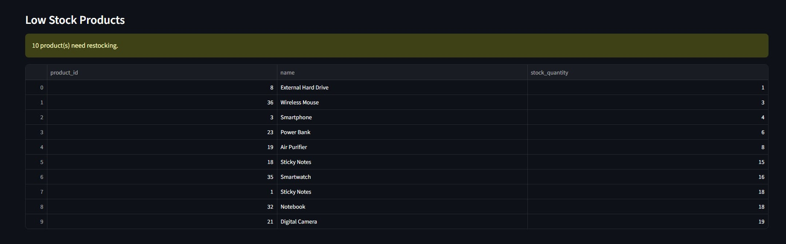
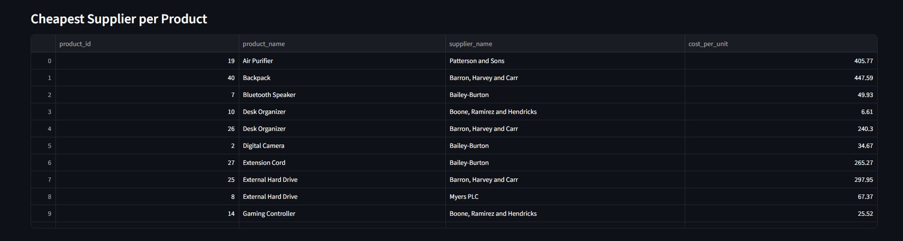

# Sales-Inventory-Analytics

OVERVIEW

This is an app made for small-business sales and inventory analytics.
It has features including:

    -generating realistic synthetic sales and inventory data
    -database storing customers, products, orders, and suppliers
    -SQL queries for top sellers, profit, low stock, and supplier cost
    -interactive dashboard to view all insights live

__________________________________________________________________________________________________

RELEASE NOTES

Version 1.0.0
	The Sales & Inventory Analytics Dashboard generates synthetic business data and loads it into a
	SQLite database. The app runs SQL queries to find the top-selling products, the most profitable
	products, products low on stock, and the cheapest supplier for each product. All of this is
	displayed live in a Streamlit dashboard with charts and alerts.

__________________________________________________________________________________________________

DASHBOARD PREVIEW

__________________________________________________________________________________________________

SETTING UP THE APP

Required to use the app:

    -install python package
    -install the packages listed in requirements.txt 

Download python from this link:

	https://www.python.org/downloads/

To set up the app:

    - Clone or download this repository
    - Open VSCode
    - Open the folder where the project was downloaded
    - Open a terminal and run:
        python -m venv venv
        venv\Scripts\activate
        pip install -r requirements.txt

To generate the data and build the database, run these in order:

    python src\generate_data.py
    python src\database_setup.py
    python src\load_data.py

__________________________________________________________________________________________________

RUNNING THE APP

	To run the app just copy paste this in the terminal:
			streamlit run src\dashboard.py

	This opens the dashboard in the browser at localhost:8501

__________________________________________________________________________________________________

ARCHITECTURE SUMMARY

	- Function-based design, separated by responsibility

	├── README.md
	├── requirements.txt
	├── database/
	│   ├── schema.sql
	│   └── sales.db
	├── data/
	│   ├── customers.csv, products.csv, orders.csv
	│   └── order_items.csv, suppliers.csv, supplies.csv
	├── src/
	│   ├── generate_data.py
	│   ├── database_setup.py
	│   ├── load_data.py
	│   ├── analysis.py
	│   └── dashboard.py
	└── documentation/
	    └── screenshots/

__________________________________________________________________________________________________

REFLECTION

	- In this project, I learned how to design a relational database from scratch, including how to 
    resolve many-to-many relationships using junction tables and generate mock realistic fake data. 
    I also learned how to connect Python to SQLite using connections and cursors, and also learned 
    how to write SQL JOINs, GROUP BY, and subqueries to turn raw data into real business insights, 
    and how to use pandas and Streamlit to display those insights in a live dashboard. 

__________________________________________________________________________________________________

FUTURE PLANS

	- Add an AI chatbot to directly ask questions about the data
	- Add date-range filtering for monthly sales trends
	- Deploy the dashboard online so it can be shared with a live link